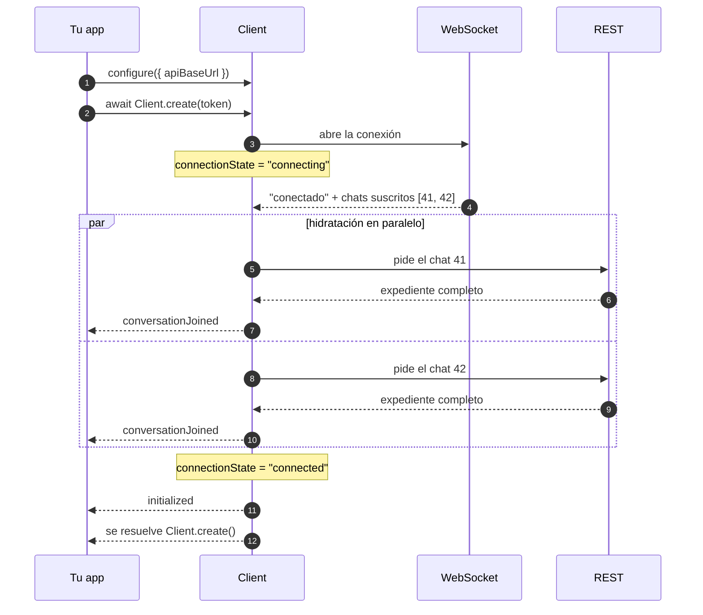

# Primeros pasos

De cero a un chat funcionando. Asume que ya leíste [Conceptos](conceptos.md) — si no, hazlo
primero: son diez minutos y aquí se dan por sabidos.

---

## Lo que necesitas antes de empezar

**La dirección del backend de chat.** Es un host propio, distinto del gateway principal. En
`sbx-omnichannel-ui` se resuelve por tenant en tiempo de ejecución, porque cambia según el
cliente.

**Un token de agente.** Lo emite tu backend cuando el agente inicia sesión. Tiene que llevar el
claim `agent_id`, o no vas a poder mandar adjuntos.

---

## Instalar

```bash
npm install sbx-omnichannel-conversations
```

---

## Los tres pasos obligatorios

```ts
import { configure, Client } from "sbx-omnichannel-conversations";

// 1 — Una sola vez al arrancar la app, antes de crear ningún cliente.
configure({ apiBaseUrl: "https://omnichannel.example.com" });

// 2 y 3 — Crear el cliente y esperar a que esté listo, en una línea.
const client = await Client.create(token);
```

Eso es todo. Cuando esa última línea termina, las conversaciones del agente ya están cargadas.

> **Por qué `Client.create()` y no `new Client()`.** Los dos funcionan, pero `new Client()`
> devuelve **antes** de que haya nada cargado: te da el objeto y sigue trabajando por detrás. Si
> preguntas por las conversaciones justo después, la lista sale vacía. `create()` espera.

---

## Qué pasa por dentro mientras esperas



Fíjate en los pasos 5 al 11: entre que el socket conecta y que tienes objetos usables hay **dos
viajes de red más**. Todo lo que hagas antes del paso 13 ve una lista vacía. Por eso existe
`create()`.

---

## Tu primer chat en pantalla

```ts
import { configure, Client } from "sbx-omnichannel-conversations";

configure({ apiBaseUrl: "https://omnichannel.example.com" });
const client = await Client.create(token);

// La lista completa, ya cargada.
const { items: conversaciones } = await client.getSubscribedConversations();
for (const c of conversaciones) {
  console.log(c.sid, c.friendlyName, await c.getUnreadMessagesCount());
}
// → "CH-8f21a" "Ada Lovelace" 2
// → "CH-1c904" "+573001112233" 0

// Los mensajes de uno de ellos.
const { items: mensajes } = await conversaciones[0].getMessages(30);
for (const m of mensajes) console.log(`[${m.index}] ${m.author}: ${m.body}`);
// → [4102] customer_4471: buenas, sigue disponible el plan?
// → [4187] agent_99: claro que sí, ¿te cuento?

// Todo lo que llegue, en vivo, en cualquier chat.
client.on("messageAdded", (mensaje) => {
  console.log(`${mensaje.author}: ${mensaje.body}`);
});

// Responder.
await conversaciones[0].sendMessage("Te escribo los detalles por aquí");
```

Ningún valor de arriba es inventado: así se ven de verdad. Si te llama la atención que los
índices sean `4102` y `4187` en vez de `0` y `1`, está explicado en
[Conceptos](conceptos.md#el-índice-de-un-mensaje-no-es-una-posición).

---

## Reaccionar a que se caiga la red

La librería reconecta sola. Lo único que tienes que hacer es reflejarlo en pantalla:

```ts
client.on("connectionStateChanged", (estado) => {
  // "connecting" | "connected" | "disconnecting" | "disconnected" | "denied"
  mostrarIndicador(estado);
});

client.on("connectionError", (error) => {
  if (error.terminal) {
    pedirTokenNuevo();          // no va a reconectar solo
  } else {
    mostrarAviso("Sin conexión, reintentando…");
  }
});
```

Y si necesitas saber el estado **ahora**, sin esperar al próximo evento:

```ts
if (client.connectionState === "connected") { /* ... */ }
```

---

## Renovar el token antes de que caduque

La librería avisa tres minutos antes. Aprovecha ese aviso: renovar en `tokenExpired` ya es tarde.

```ts
client.on("tokenAboutToExpire", async () => {
  await client.updateToken(await pedirTokenNuevo());
});
```

`updateToken()` reemplaza la conexión sin destruir el cliente: las conversaciones y los listeners
siguen vivos.

---

## Apagar al desmontar

```ts
client.shutdown();
```

Cierra la conexión, cancela los temporizadores y rechaza los envíos en vuelo. Después de esto el
cliente no se puede reutilizar: para volver a conectar, crea uno nuevo.

En React:

```tsx
useEffect(() => {
  let vivo = true;
  let cliente: Client | null = null;

  (async () => {
    const c = await Client.create(token);
    // Si el componente se desmontó mientras esperábamos, apagarlo y no publicarlo.
    if (!vivo) { c.shutdown(); return; }
    cliente = c;
    setClient(c);
  })();

  return () => { vivo = false; cliente?.shutdown(); };
}, [token]);
```

Ese `vivo` importa: `create()` tarda, y sin él un desmonte rápido deja un cliente conectado que
nadie va a apagar nunca.

---

## Y ahora

- [Referencia](reference/) — qué hace cada función, con ejemplos y errores.
- [Solución de problemas](solucion-de-problemas.md) — cuando algo no sale como esperabas.
